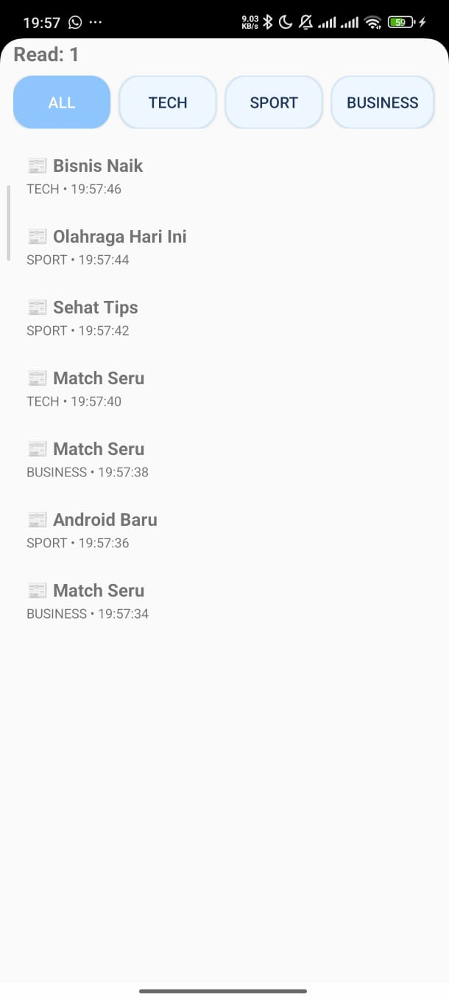
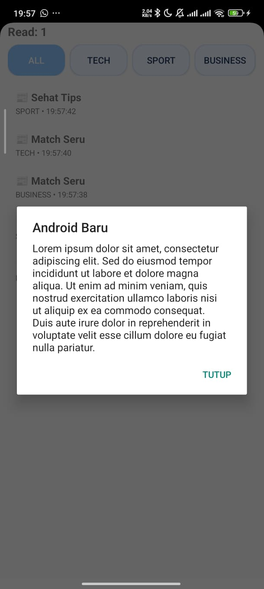
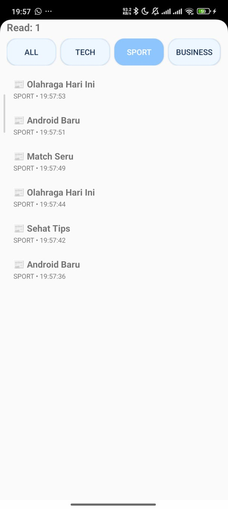

# News Feed Simulator – Tugas 2 PAM

* **Nama** : Nadya Shafwah Yusuf
* **NIM** : 123140167
* **Kelas** : PAM RB
* **Mata Kuliah** : Pemrograman Aplikasi Mobile

---

## Deskripsi Aplikasi

Aplikasi ini menampilkan daftar berita yang diperbarui secara otomatis setiap 2 detik, menyediakan fitur filter kategori, serta menampilkan detail berita dalam bentuk popup dialog.

---

## Spesifikasi yang Diimplementasikan

### 1. Flow – Stream Berita Otomatis

Aplikasi menggunakan `Flow` untuk menghasilkan data berita secara berkala setiap 2 detik.

```kotlin
fun stream(): Flow<News>
```

Berita baru otomatis masuk ke daftar menggunakan coroutine dan Flow collection.

---

### 2. Filter Berita Berdasarkan Kategori

Pengguna dapat memfilter berita berdasarkan kategori:

* ALL
* TECH
* SPORT
* BUSINESS
* HEALTH

Filter diimplementasikan menggunakan:

```kotlin
private val _cat = MutableStateFlow<Cat?>(null)
val cat: StateFlow<Cat?> = _cat.asStateFlow()
```

Data ditransformasikan menggunakan `combine()` untuk menghasilkan list yang sesuai kategori.

---

### 3. Transformasi Data untuk Tampilan (UI Model)

Data mentah `News` ditransformasikan menjadi `NewsUi` sebelum ditampilkan di RecyclerView:

```kotlin
combine(list, cat) { a, b -> ... }
```

Transformasi ini bertujuan memisahkan model data dan model tampilan (best practice MVVM).

---

### 4. StateFlow – Jumlah Berita yang Dibaca

Jumlah berita yang diklik/disimulasikan sebagai "dibaca" disimpan menggunakan `StateFlow`.

```kotlin
private val _read = MutableStateFlow(0)
val read: StateFlow<Int> = _read.asStateFlow()
```

Setiap berita diklik:

```kotlin
_read.update { it + 1 }
```

Nilai ini langsung ditampilkan di halaman utama dalam format:

```
Read: X
```

---

### 5. Coroutine Async – Mengambil Detail Berita

Detail berita diambil secara asynchronous menggunakan coroutine dan `async`.

```kotlin
viewModelScope.launch(Dispatchers.IO) {
    val dd = async { r.detail(id, title) }
    _d.value = dd.await()
}
```

Detail ditampilkan dalam bentuk **AlertDialog popup** yang dapat ditutup.

---

## Tampilan Aplikasi

### Tampilan Utama

* Daftar berita (RecyclerView)
* Jumlah berita yang sudah dibaca
* Tombol filter kategori dengan efek biru pastel aktif

### Screenshot Tampilan Utama



---

### Tampilan Detail (Popup)

* Judul berita
* Isi berita (Lorem Ipsum)
* Tombol "Tutup"

### Screenshot Tampilan Detail



---

### Tampilan Filter Aktif

* Tombol kategori berubah warna biru pastel saat aktif
* Efek pressed saat ditekan

### Screenshot Tampilan Filter



---

## Struktur Project

```
com.example.tugas2pam
│
├── data
│   └── NewsRepo.kt
│
├── model
│   └── Models.kt
│
├── ui
│   ├── NewsVM.kt
│   └── NewsAdapter.kt
│
└── MainActivity.kt
```

---

## Cara Menjalankan Aplikasi

1. Clone repository
2. Buka project di Android Studio
3. Sync Gradle
4. Jalankan menggunakan emulator atau device Android

