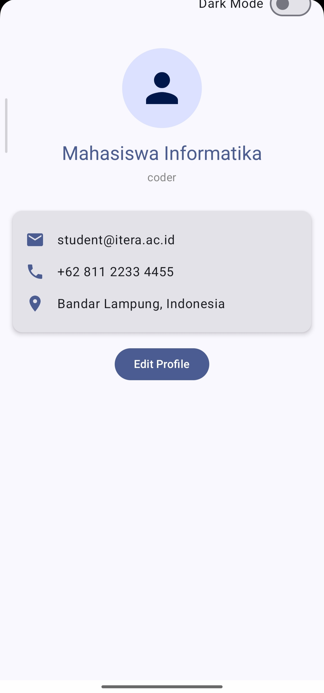
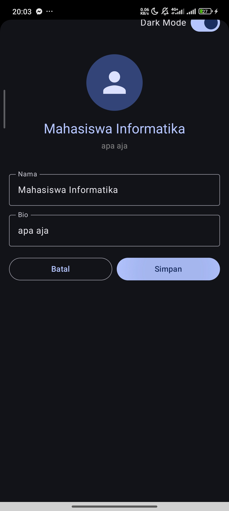
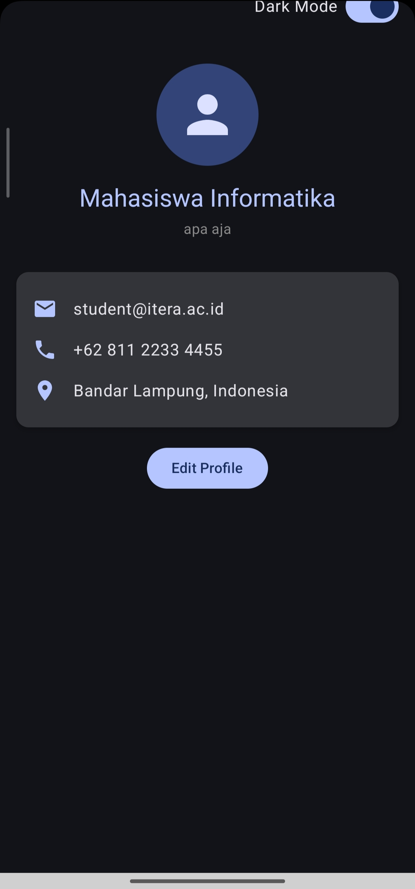

# My Profile App – Tugas Praktikum 4 PAM

* **Nama** : Nadya Shafwah Yusuf
* **NIM** : 123140167
* **Kelas** : PAM RB
* **Mata Kuliah** : Pengembangan Aplikasi Mobile

---

## Deskripsi Aplikasi

"My Profile App" adalah aplikasi profil pengguna interaktif yang dibangun menggunakan **Compose Multiplatform**. Aplikasi ini telah menerapkan arsitektur **MVVM (Model-View-ViewModel)** untuk memisahkan logika bisnis dari tampilan antarmuka. Dilengkapi dengan fitur edit data profil yang menerapkan konsep *State Hoisting* serta fitur *Dark Mode Toggle* yang *state*-nya tersimpan dengan aman di dalam ViewModel. Seluruh aplikasi ini dirancang dengan sentuhan antarmuka bertema biru.

---

## Spesifikasi yang Diimplementasikan

### 1. Arsitektur MVVM & UI State Pattern

Aplikasi memisahkan secara tegas antara data (Model), logika (ViewModel), dan tampilan (View). Seluruh *state* yang dibutuhkan oleh UI dibungkus rapi dalam sebuah *data class* `ProfileUiState`.

```kotlin
data class ProfileUiState(
    val profile: Profile = Profile(),
    val isDarkMode: Boolean = false,
    val isEditing: Boolean = false,
    val editNameInput: String = "",
    val editBioInput: String = ""
)  
```

### 2. StateFlow – Reaktivitas Data ViewModel
Semua perubahan data (nama, bio, maupun tema) dikelola di dalam ProfileViewModel menggunakan MutableStateFlow dan diobservasi oleh antarmuka melalui fungsi .collectAsState().Kotlinprivate val _uiState = MutableStateFlow(ProfileUiState())
```
val uiState: StateFlow<ProfileUiState> = _uiState.asStateFlow()
```
Pembaruan data dilakukan secara immutable menggunakan .update dan .copy():Kotlin
```
fun toggleDarkMode(isDark: Boolean) {
    _uiState.update { it.copy(isDarkMode = isDark) }
}
```

### 3. State Hoisting – Form Edit Profil
Komponen EditProfileForm dibuat sebagai stateless composable agar lebih reusable dan mudah diuji. Komponen ini tidak menyimpan nilai inputannya sendiri, melainkan menerimanya dari parent beserta fungsi callback untuk mengubah nilai tersebut.Kotlin@Composable
```
fun EditProfileForm(
    nameInput: String,
    onNameChange: (String) -> Unit,
    bioInput: String,
    onBioChange: (String) -> Unit,
    onSave: () -> Unit,
    onCancel: () -> Unit
)
```
### 4. Fitur Dark Mode Toggle
Fitur mode gelap/terang diimplementasikan menggunakan tombol Switch. State dari tema ini disimpan di ViewModel sehingga survive configuration change (tidak reset jika layar diputar) dan nilainya diumpankan langsung ke tema utama aplikasi di MainActivity.
```
KotlinTugas34PAMTheme(darkTheme = uiState.isDarkMode) {
    // ...
}
```

## Tampilan Aplikasi
### 1. Tampilan Utama (Profile View)
Menampilkan header dengan avatar melingkar, nama, dan bio. Informasi detail terbungkus dalam komponen Card dengan efek elevasi.

### 2. Form Edit (Edit Feature)
Menggantikan Card informasi dengan form input OutlinedTextField saat mode edit aktif.
Terdapat tombol "Batal" dan "Simpan" untuk memodifikasi ProfileUiState.

### 3. Dark Mode
Seluruh warna antarmuka otomatis menyesuaikan menjadi skema warna gelap bawaan Material 3 ketika switch di pojok kanan atas diaktifkan.



## Struktur Project
Struktur folder telah dikelompokkan berdasarkan fungsinya untuk mendukung clean architecture:
```
com.example.tugas3_4pam
│
├── data
│   ├── Profile.kt
│   └── ProfileUiState.kt
│
├── ui
│   ├── components
│   │   ├── DarkModeToggle.kt
│   │   ├── EditProfileForm.kt
│   │   ├── InfoItem.kt
│   │   ├── ProfileCard.kt
│   │   └── ProfileHeader.kt
│   ├── screens
│   │   └── ProfileScreens.kt
│   └── theme
│       ├── Color.kt
│       ├── Theme.kt
│       └── Type.kt
│
├── viewmodel
│   └── ProfileViewModel.kt
│
└── MainActivity.kt
```
Cara Menjalankan AplikasiClone repository ini.Buka project menggunakan Android Studio.Pastikan dependency lifecycle-viewmodel-compose sudah terunduh (lakukan Sync Gradle jika perlu).Jalankan menggunakan emulator Android atau perangkat Android fisik.